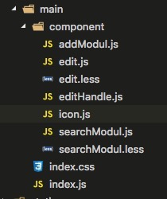

# 主子表代码解析

#### 第一步

分析主子表目录结构，根据结构来分析其写法对照币种表，有哪些不同。我们看如下图，在main文件夹📂内有一个文件夹component，前文我们说过，公用组件存放在components文件夹内，而单单独页面使用的组件存放在component文件夹内，如图内所示，component内包括，addModul、edit、editHandle、等组件，这些组件都为主子表页面单独使用，使用组件，易于管理，方便复用。




#### 第二步

看index.js代码

```
import React, { Component } from "react";
import classnames from 'classnames';
import { Table, Pagination } from "tinper-bee";
// 内部组件
import EditModul from "./component/edit";
import Logo from "./component/icon";
import AddModul from "./component/addModul";
import SearchModul from "./component/searchModul";
import EditHandle from "./component/editHandle";
import {Link} from 'mirrorx';
```

上面代码不多说，引入外部组件。

```
const tableColumns = [
    {
        dataIndex: 'description',
        key: 'description',
        title: '备注'
    },
    {
        dataIndex: 'status',
        key: 'status',
        title: '状态'
    },
    // {
    //     dataIndex: 'ipuquotaionid',
    //     key: 'ipuquotaionid',
    //     title: '主键'
    // },
    {
        dataIndex: 'corp_account',
        key: 'corp_account',
        title: '银行账号'
    },
    {
        dataIndex: 'processor',
        key: 'processor',
        title: '录入人'
    },
    {
        dataIndex: 'processtime',
        key: 'processtime',
        title: '订单日期'
    },
    {
        dataIndex: 'currencyid',
        key: 'currencyid',
        title: '币种'
    },
    {
        dataIndex: 'currency_code',
        key: 'currency_code',
        title: '币种编码'
    },
    {
        dataIndex: 'ecbillcode',
        key: 'ecbillcode',
        title: '订单编号'
    },
    {
        dataIndex: 'contact',
        key: 'contact',
        title: '联系人'
    },
    {
        dataIndex: 'phone',
        key: 'phone',
        title: '联系电话'
    }
];
const columnsChild = [
    { title: "备注", dataIndex: "productdesc", key: "productdesc" },
    { title: "产品", dataIndex: "productname", key: "productname" },
    { title: "订单金额", dataIndex: "purchaseamount", key: "purchaseamount" },
    { title: "单位", dataIndex: "unit", key: "unit" }
];
```

定义主表和子表的表头。const 为ES6语法定义常量，不可修改。


定义Main组件

```
export default class Main extends Component 
```

组件内部定义状态

```
 constructor(props) {
        super(props);
        this.state = {
            // 子表数据
            children_data: [],
            // 展开收起
            toggle: false,
            // 当前选中行数
            curIndex: '',
            // 增加数据模块
            isAddData: false,
            // 搜索模块
            isSearch: false,
            // 编辑模块
            isEdit: false,
            //表格数据(此处数据应从后台获取)
            tableData: [
                {
                    'description': '备注1',
                    'status': '启用',
                    'subject': '李小龙',
                    'ipuquotaionid': '主键',
                    'corp_account': '8888 888 8888',
                    'processor': '房帅中',
                    'processtime': '2012-01-09',
                    'currencyid': '真',
                    'currency_code': '001',
                    'ecbillcode': '000021',
                    'contact': '李小龙',
                    'phone': '198888',
                    'key': 0,
                    'children_data': [
                        { ipuquotationdetailid: '1', productdesc: '备注1', productname: '产品1_1', purchaseamount: 1000, unit: '元', quotationid: '1', key: '1' },
                        { ipuquotationdetailid: '2', productdesc: '备注2', productname: '产品1_2', purchaseamount: 1000, unit: '元', quotationid: '2', key: '2' },
                    ]
                },
                {
                    'description': '假装是个备注',
                    'status': '启用',
                    'subject': '甄子丹',
                    'ipuquotaionid': '主键',
                    'corp_account': '8888 888 8888',
                    'processor': '房帅中',
                    'processtime': '2012-01-09',
                    'currencyid': '真',
                    'currency_code': '001',
                    'ecbillcode': '000021',
                    'contact': '甄子丹',
                    'phone': '18701517173',
                    'key': 1,
                    'children_data': [
                        { ipuquotationdetailid: '1', productdesc: '备注2_1', productname: '产品2_1', purchaseamount: 1000, unit: '元', quotationid: '1', key: '1' },
                    ]
                }
            ],
            curKey: 1
        };
    }
```

组件内事件方法代码，通过下面代码可以看出我们的事件，大部分都是在处理Main组件的state即状态，在修改状态的同时处理页面显示，以及数据操作。

```
// 点击菜单展开收起
    handleToggle = () => {
        this.setState({
            toggle: !this.state.toggle
        })
    }
    // 点击行
    rowclick = (record, index, e) => {
        let {tableData} = this.state, child = tableData[index].children_data;
        this.setState({ curIndex: index, children_data: child });
    };
    // 点击增加按钮
    addData = () => {
        this.setState({
            isAddData: true
        })
    }
    // 取消添加
    cancelAdd = () => {
        this.setState({
            isAddData: false
        })
    }
    // 添加数据
    addButton = (obj) => {
        let {tableData, curKey} = this.state;
        console.log(curKey += 1);
        let addData = {
            'description': obj.mName,
            'status': '启用',
            'subject': '甄子丹',
            'ipuquotaionid': '主键',
            'corp_account': '8888 888 8888',
            'processor': '房帅中',
            'processtime': '2012-01-09',
            'currencyid': '真',
            'currency_code': '001',
            'ecbillcode': '000021',
            'contact': obj.mUser,
            'phone': '18701517173',
            'key': curKey,
            'children_data': obj.childData
        }
        tableData.push(addData)
        this.setState({
            tableData, curKey, isAddData: false
        })
    }
    // 删除数据
    deleteData = () => {
        let {curIndex, tableData, children_data} = this.state;
        if (curIndex === '') {
            alert('请选择删除')
        } else {
            tableData.splice(curIndex, 1);
            this.setState({
                tableData, children_data: []
            })
        }
    }
    // 编辑数据
    handleEdit = () => {
        this.setState({
            isEdit: true
        })
    }
    // 取消编辑
    cancelEdit = () => {
        this.setState({
            isEdit: false
        })
    }
    // 冻结数据
    frozen = () => {
        console.log('冻结数据');
        let {curIndex, tableData, children_data} = this.state;
        if (curIndex === '') {
            alert('请选择数据')
        } else {
            tableData[curIndex].status = '停用';
            console.log(tableData[curIndex]);
            this.setState({
                tableData
            })
        }

    }
    cancelFrozen = () => {
        let {curIndex, tableData, children_data} = this.state;
        if (curIndex === '') {
            alert('请选择数据')
        } else {
            tableData[curIndex].status = '启用';
            console.log(tableData[curIndex]);
            this.setState({
                tableData
            })
        }
    }
```


渲染部分代码

```
 render() {
        let sh = { height: '100%' },
            {toggle, isAddData, isSearch, tableData, isEdit} = this.state;
        return (
            <div>
                <Link to="/">首页</Link>
                <EditModul
                    addData={this.addData}
                    deleteData={this.deleteData}
                    handleEdit={this.handleEdit}
                    frozen={this.frozen}
                    cancelFrozen={this.cancelFrozen} />
                <EditHandle
                    isEdit={isEdit}
                    cancelEdit={this.cancelEdit} />
                <AddModul
                    isAddData={isAddData}
                    cancelAdd={this.cancelAdd}
                    addButton={this.addButton} />
                <div>{isAddData ? "" :
                    <div>
                        <SearchModul
                            isSearch={isSearch} />
                        <Table
                            style={{ width: '100%' }}
                            columns={tableColumns}
                            data={tableData}
                            onRowClick={this.rowclick}
                            title={currentData => <div>标题: 我是主表</div>}
                        />
                        <Table
                            style={{ marginTop: 40 }}
                            columns={columnsChild}
                            data={this.state.children_data}
                            title={currentData => <div>标题: 我是子表</div>}
                        />
                    </div>
                }</div>

            </div>
        );
    }
```

#### 第三步

分析子组件

此处我们以简单的编辑组件为例讲解，父组件与子组件传递数据

```
import React, { Component } from 'react';
import { Button } from 'tinper-bee';
//引入edit样式
require('./edit.less');
export default class EditModul extends Component {
    constructor(props) {
        super(props)

    }
    render() {
        return (
            <div className="edit_modul">
            此处通过this.props 来拿到 父组件的方法，当点击子组件的元素时，来执行父组件定义的方法，从而来实现，组件之间的相互传值，调用。
                <Button onClick={this.props.addData}>增加</Button>
                <Button onClick={this.props.deleteData}>删除</Button>
                <Button onClick={this.props.handleEdit}>编辑</Button>
                <Button onClick={this.props.frozen}>冻结</Button>
                <Button onClick={this.props.cancelFrozen}>取消冻结</Button>
            </div>
        )
    }
}
```

